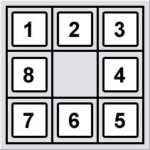
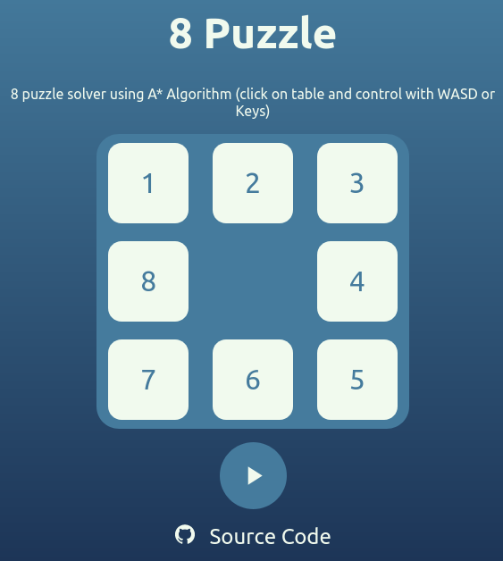

# 8-Puzzle Agent

Este projeto consiste de um agente autônomo para resolver o desafio 8-Puzzle e é parte da entrega intermediária da eletiva de [Agentes Autônomos e Reinforcement Learning](http://fbarth.net.br/agents/).

---

## O desafio

O desafio 8-Puzzle consiste no seguinte: um tabuleiro 3x3 com peças móveis na vertical e horizontal marcadas com números de 1 a 8 e um espaço vazio para onde pode ser movido qualquer uma das peças adjacentes, o objetivo é sair de um tabuleiro *bagunçado* para um estado meta definido (que pode ser qualquer outra configuração possível do tabuleiro e nesse caso são os números ordenados como formato de caracol).

Um exemplo pode ser visto na imagem abaixo, a esquerda o estado inicial e a direita o estado meta.

<div style="display : flex; justify-content: space-around;">




</div>


## Setup do ambiente para execução do agente

Configure um ambiente virtual:

```
python3 -m virtualenv venv
source venv/bin/activate
```

Instalando dependências:

```
python3 -m pip install --upgrade pip
pip install -r requirements.txt
```

Execute o solver.py e você deve visualizar o seguinte:

```
Estado inicial - Busca Gananciosa
2 8 3
1 4 0
7 6 5
Achou!
 ; 0 <--> 4 ; 0 <--> 8 ; 0 <--> 2 ; 0 <--> 1 ; 0 <--> 8
Tempo de espera: 0.0010349750518798828 segundos
```

```
> solver.py -h

usage: solver [-h] [-a ALGORITHM] [-H HEURISTIC] [-s STATE]

optional arguments:
  -h, --help            show this help message and exit
  -a ALGORITHM, --algorithm ALGORITHM
  -H HEURISTIC, --heuristic HEURISTIC
  -s STATE, --state STATE
```

## Raciocínio do Código

O estado escolhido para representar uma configuração do tabuleiro é composto por quatro atributos:

-   Uma matriz 3x3 que representa o tabuleiro, onde cada elemento carrega o valor da peça nessa posição e 0 representa o espaço vazio;
-   Uma tupla chamada *exclude_move*, essa tupla serve para realizar uma poda na árvore de busca e vai ser o movimento contrário ao último movimento feito, para evitar que o agente fique preso em *poços* de mínimo, trocando sempre a mesma peça de lugar;
-   Um operador, normalmente uma *string* indicando o último movimento feito;
-   Um atributo *heuristic* para selecionar uma dentre as múltiplas heurísticas.

A geração de sucessores funciona da seguinte maneira:

```
LOCALIZAR zero
PARA CADA possibilidade DENTRE possiveis_movimentos
    SE possibilidade DIFERENTE DE exclude_move
        TROCA zero COM possibilidade
        ADICIONA A sucessores
```

## Heurística

Foram implementadas quatro heurísticas admissíveis (e é possível escolher uma dentre elas pelo parâmetro *heuristic* da *Class Puzzle*.

Estas são:

- Número de posições erradas (*match*): a heurística é o número de posições erradas no estado atual comparado com o estado meta, excluída a posição vazia. Uma heurística fraca e pouco recomendada;
- Distância de Manhattan (*manhattan*): a distância de Manhattan é simplesmenta a soma da distância vertical e horizontal de uma peça no estado atual até a posição desta no estado meta, heurística mais indicada;
- Distância Euclidiana (*euclidian*): exatamente como na geometria, distância euclidiana entre a peça no estado atual e a mesma no estado meta, não representa um ganho significativo para a distância de Manhattan, mas diminui a possibilidade de *empates* entre estados;
- Distância de Manhattan com Penalidade (*manhattan2*): é a distância de Manhattan mais uma penalidade de 2 para cada par diretamente reversível, isto é, um par cuja inversão direta já deixaria cada uma das peças na posição ótima, melhora significativamente a distância de Manhattan, é ótima, admissível, mas pode demorar para ser calculada. Inspirada no trabalho [Solving the 8 Puzzle in a Minimum Number of Moves: An Application of the A* Algorithm](https://web.mit.edu/6.034/wwwbob/EightPuzzle.pdf);
- Distância Euclidiana com Penalidade (*euclidian2*): é a distância euclidiana com a penalidade de *manhattan2*.

## Testes

Para realizar os testes basta executar

```
> pytest tests.py --capture=tee-sys
============= 5 passed in 0.06s =============
```

## API

Foi criada uma API para resolver a interface online. Uma versão pode ser rodada localmente e acessada em localhost:8000

```
> uvicorn main:app --reload
INFO:     Will watch for changes in these directories: ['/path/to/8-puzzle-agent']
INFO:     Uvicorn running on http://127.0.0.1:8000 (Press CTRL+C to quit)
INFO:     Started reloader process [135459] using watchgod
INFO:     Started server process [135461]
INFO:     Waiting for application startup.
INFO:     Application startup complete.
```

Foi feito deploy com a plataforma de microsservices [Deta](https://www.deta.sh/) e uma documentação gerada automaticamente para testes pode ser acessada [aqui](https://cthl98.deta.dev/docs).

## WebApp

Foi criado por último um aplicativo web, iterativo, onde é possível testar o algoritmo que se encontra em [https://cemmanuelsr.github.io/react-8-puzzle](https://cemmanuelsr.github.io/react-8-puzle).



### Observação

O requirements.txt foi criado com o módulo pipreqs, se necessário, voltar para o commit d4edf71a554cc60046928b20c2a6ed36a5c11c4f e utilizar o requirements.txt desse momento.
